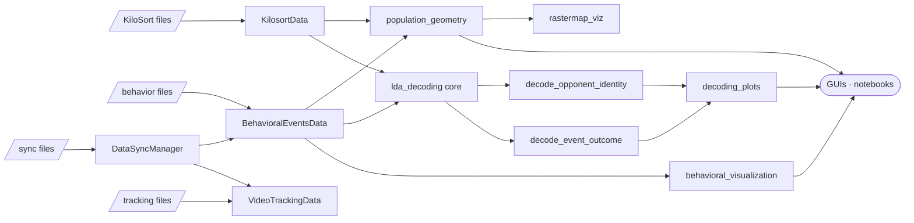

# Habitat Pipeline — Architecture

Multi-animal electrophysiology and behavioral analysis pipeline for freely behaving animals (RatCity cohorts). Loads spike-sorted neural data (Kilosort 4) and behavioral data (tracking + scored events), aligns them on a common clock, and supports decoding, population geometry, and visualization workflows through a Python API, a CLI, two GUIs, and notebooks.

## High-Level Architecture



## Repository Layout

| Path | Purpose |
|---|---|
| [config/](config/) | JSON cohort configs (`default_paths.json` = cohort 7, `cohort5_paths.json`). |
| [ingestion/](ingestion/) | Path discovery, Kilosort 4 loading, Trodes binary I/O, ephys↔behavior clock sync. |
| [video/](video/) | Tracking ingestion, behavioral event records, trajectory and event visualization. |
| [ephys/](ephys/) | Shared LDA decoding core, opponent/outcome/location decoders, decoding plots, population geometry, rastermap, QA. |
| [database/](database/) | SQLAlchemy ORM + CLI for session/animal/file metadata (`habitat_pipeline.db`). |
| [gui/](gui/) | Streamlit dashboard ([gui/app.py](gui/app.py) + [gui/tabs/](gui/tabs/)) and Panel app ([gui/interactive_app.py](gui/interactive_app.py)). |
| [workflow.py](workflow.py) | End-to-end CLI orchestrator (legacy; main entry points are now the GUIs and the per-module decoders). |
| [tests/](tests/) | pytest suite + demo notebooks. |

## Module Reference

### `config/` — Path Configuration

Plain JSON files declaring root paths for `ephys`, `video`, `tracking`, and `events`. The active config is loaded by `DataStorageManager`, which resolves session-level paths from it. Two cohorts ship by default; `cohort_paths.json`-style files can be added freely and selected by passing `config_path=` to `DataStorageManager`.

### `ingestion/` — Data Discovery and I/O

[ingestion/data_paths.py](ingestion/data_paths.py) — central path manager.

| Symbol | Purpose |
|---|---|
| `DataStorageManager(animal_id, session_id, config_path=None, auto_load=True)` ([ingestion/data_paths.py:492](ingestion/data_paths.py#L492)) | Discovers and validates all session files; hub passed to downstream loaders. |
| `.get_kilosort_path()` / `.get_dio_path(channel)` / `.get_pulse_log_path()` | Resolve ephys-side paths. |
| `.get_video_files()` / `.get_tracking_files()` / `.get_behavioral_event_files()` | Resolve behavior-side paths. |
| `get_kilosort_path` / `get_dio_path` / `get_video_files_by_date` / `get_tracking_files_by_date` / `get_event_files_by_date` | Free functions returning `List[Path]`; used internally by the manager and re-exported. |
| `get_animals_and_sessions(config_path=None)` ([ingestion/data_paths.py:375](ingestion/data_paths.py#L375)) | Scan ephys root and return a DataFrame of `(session, animal, kilosort_path)` rows. |
| `verify_kilosort_path(path, check_files=True)` | Validate a kilosort4 directory has required files. |

[ingestion/kilosort_data_import.py](ingestion/kilosort_data_import.py) — high-level Kilosort 4 loader (dataclass + functional loader).

| Symbol | Purpose |
|---|---|
| `KilosortData` ([ingestion/kilosort_data_import.py:27](ingestion/kilosort_data_import.py#L27)) | Pure-data dataclass: `spike_times_by_cell`, `ks_ids`, `cluster_info`, cluster properties, metadata. |
| `.duration_seconds` (property) | Recording duration, with fallback to `spike_times_by_cell` for cache-trimmed data. |
| `.get_firing_rates()` / `.get_isi_statistics()` | Per-cluster firing-rate and ISI stats. |
| `.calculate_firing_pattern_metrics(time_bin_sec=60.0)` | Firing rate, presence ratio, CV ISI per cluster. |
| `.filter_cells_by_firing_patterns(...)` | Apply quality thresholds; returns `{passed_clusters, failed_clusters, metrics}`. |
| `.get_filtered_cells_spike_times(**filter_kwargs)` | Precomputed list of spike-time arrays for the cells that pass the filter. |
| `.bin_spike_times(bin_size_sec, ...)` | Bin spikes into a (cells × bins) firing-rate matrix; supports filtering and time windows. |
| `load_kilosort_data(path, force_reload=False)` ([ingestion/kilosort_data_import.py:607](ingestion/kilosort_data_import.py#L607)) | Path-based loader with on-disk pickle cache and Kilosort-folder auto-discovery. |
| `save_kilosort_data(...)` / `load_kilosort_from_file(...)` | Persist or reload a `KilosortData` instance to/from a pickle. |

[ingestion/kilosort_data.py](ingestion/kilosort_data.py) — low-level Kilosort file parser used internally by the high-level loader.

[ingestion/ephys_sync.py](ingestion/ephys_sync.py) — ephys↔behavior clock alignment via DIO inter-pulse intervals.

| Symbol | Purpose |
|---|---|
| `load_ephys_sync(data_manager, dio_channel=1)` ([ingestion/ephys_sync.py:14](ingestion/ephys_sync.py#L14)) | Load DIO pulses + pulse-log timestamps from a `DataStorageManager`. |
| `find_sync_mapping(TSESync, TSBSync, system_time, ...)` ([ingestion/ephys_sync.py:50](ingestion/ephys_sync.py#L50)) | Linear regression on matched IPIs; returns `slope`, `intercept`, `r_squared`, matched arrays. |
| `DataSyncManager(data_manager, dio_channel=1)` ([ingestion/ephys_sync.py:230](ingestion/ephys_sync.py#L230)) | Stateful sync object exposing `convert_ephys_to_behavior(t)` / `convert_behavior_to_ephys(t)`. |
| `plot_sync_results(mapping_dict, ...)` ([ingestion/ephys_sync.py:125](ingestion/ephys_sync.py#L125)) | 4-panel diagnostic plot for sync quality. |

[ingestion/trodes_to_python.py](ingestion/trodes_to_python.py) — `readTrodesExtractedDataFile()` for SpikeGadgets binary DIO/LFP files.

### `video/` — Tracking and Behavioral Events

[video/tracking_import.py](video/tracking_import.py) — multi-animal position tracking loader.

| Symbol | Purpose |
|---|---|
| `VideoTrackingData` ([video/tracking_import.py:28](video/tracking_import.py#L28)) | Dataclass: `parsed_data` (per-object DataFrames), `timestamps`, `tracking_file`. |
| `.get_object_names()` / `.get_object_data(name)` / `.get_object_trajectory(name)` | Inspect parsed objects. |
| `.synchronize_with_ephys(sync_manager)` | Convert frame timestamps to ephys seconds. |
| `parse_tracking(df)` ([video/tracking_import.py:165](video/tracking_import.py#L165)) | Split a combined frame into per-animal DataFrames. |
| `load_timestamps(path)` ([video/tracking_import.py:190](video/tracking_import.py#L190)) | Locate and read the paired `*_ts.npy` timestamp file. |
| `load_tracking_data(source, file_index=0, load_ts=True)` ([video/tracking_import.py:213](video/tracking_import.py#L213)) | Loader accepting a `DataStorageManager` or a raw path. |

[video/behavioral_events.py](video/behavioral_events.py) — scored interaction events.

| Symbol | Purpose |
|---|---|
| `BehavioralEventsData` ([video/behavioral_events.py:26](video/behavioral_events.py#L26)) | Dataclass holding `events_data` (DataFrame), `event_files`, session id, and a class-level `BEHAVIOR_TYPES` abbreviation map. |
| `.synchronize_with_ephys(sync_manager, create_new_columns=True)` | Add `ts_*_ephys` columns aligned to neural clock. |
| `.extract_opponent_labels(animal, behavior_type, min_events_per_class)` | Per-event opponent identity labels for decoding. |
| `.extract_group_labels(...)` | Pool opponents into `'low'`/`'high'` ID groups (numeric-suffix split). |
| `.extract_outcome_labels(animal, behavior_type, ...)` | `'winner'`/`'loser'` labels for the focal animal. |
| `.get_events_by_type()` / `.get_events_by_rat()` / `.get_available_event_types()` / `.get_available_rats()` | Filtering and inventory helpers. |
| `load_behavioral_events(files, session_id=...)` ([video/behavioral_events.py:426](video/behavioral_events.py#L426)) | Free loader; accepts a path, directory, or list of CSVs. |

[video/behavioral_visualization.py](video/behavioral_visualization.py) — event-centric plots.

| Symbol | Purpose |
|---|---|
| `plot_rat_interaction_heatmap(events, ...)` | Pairwise interaction counts between animals, filterable by event type. |
| `plot_rat_behavior_heatmap(events, ...)` | Per-animal behavior frequency heatmap. |
| `plot_behavioral_event_timeline(events, ...)` | Event raster across the session (Y reordered by frequency). |
| `plot_events_on_trajectory(events, tracking, ...)` | Overlay events on movement paths. |

[video/plot_trajectory.py](video/plot_trajectory.py) — trajectory and occupancy plots: `plot_animal_path`, `plot_multiple_paths`, `plot_path_heatmap`, `plot_territorial_occupancy`, `plot_voronoi_territories`, `plot_proximity_network`, `compute_proximity_interactions`, plus `calculate_path_distance` / `calculate_path_statistics`, and `save_visualization` for batch export.

### `ephys/` — Neural Analysis

Decoding modules share a label-agnostic core plus a shared plotting module:

- [ephys/_lda_decoding.py](ephys/_lda_decoding.py) — spike alignment, firing-rate features, quality-cell selection, per-cell LDA, per-cell population sweep, time-resolved population LDA. Returns label-agnostic result dicts (`unique_classes`, `class_counts`, …).
- [ephys/decoding_plots.py](ephys/decoding_plots.py) — `plot_decoding_accuracy_distribution`, `plot_best_cells_decoding`, `plot_decoding_summary`, `plot_time_resolved_decoding`, `plot_top_cells_firing_rates`, `plot_top_cells_rasters`. Titles/axis labels are driven by `results['parameters']['class_label']` and `['analysis_title']` so the same plots work for opponent-identity and outcome decoding.

[ephys/decode_opponent_identity.py](ephys/decode_opponent_identity.py) — opponent (and ID-group) decoding wrapper.

| Symbol | Purpose |
|---|---|
| `decode_opponent_identity_single_cell(...)` | Single-cell LDA decode wrapper, with optional `selected_opponents` filter. |
| `decode_opponent_identity_population(ks_data, behavior_data, animal_of_interest, behavior_type=None, label_mode='opponent'/'group', ...)` ([ephys/decode_opponent_identity.py:111](ephys/decode_opponent_identity.py#L111)) | Per-cell population sweep. Returns the unified per-cell result dict. |
| `decode_opponent_identity_time_resolved(...)` ([ephys/decode_opponent_identity.py:213](ephys/decode_opponent_identity.py#L213)) | Population-LDA accuracy per time bin with optional shuffle null. |
| `main()` | CLI entry. |

[ephys/decode_event_outcome.py](ephys/decode_event_outcome.py) — winner/loser decoding wrapper. Mirrors the opponent module: `decode_event_outcome_single_cell`, `decode_event_outcome_population` ([ephys/decode_event_outcome.py:85](ephys/decode_event_outcome.py#L85)), `decode_event_outcome_time_resolved`. Re-exports the shared plot functions.

[ephys/decode_location.py](ephys/decode_location.py) — decode `(x, y)` of self/other animals from population activity.

| Symbol | Purpose |
|---|---|
| `build_binned_data(ks_data, tracking_data, object_name, bin_size)` ([ephys/decode_location.py:28](ephys/decode_location.py#L28)) | Aligned firing-rate × position matrix. |
| `decode_location(...)` ([ephys/decode_location.py:248](ephys/decode_location.py#L248)) | Bayesian population decoder (posterior-mean or MAP). |
| `decode_all_locations(...)` ([ephys/decode_location.py:386](ephys/decode_location.py#L386)) | Sweep over tracked objects. |
| `plot_decoding_results` / `plot_all_decoding_summary` | Reporting plots. |

[ephys/population_geometry.py](ephys/population_geometry.py) — population dynamics and dimensionality reduction.

| Symbol | Purpose |
|---|---|
| `PopulationGeometryAnalyzer(ks_data, behavior_data)` ([ephys/population_geometry.py:46](ephys/population_geometry.py#L46)) | Build population matrices, run PCA/UMAP, analyze trajectories. |
| `.construct_population_matrix(...)` / `.apply_dimensionality_reduction(...)` | Core construction and reduction methods. |
| `.plot_population_dynamics(...)` / `.plot_population_dynamics_interactive(...)` / `.plot_pca_summary(...)` / `.plot_normalized_population_matrix(...)` | Built-in plots. |
| `plot_pca_trajectory_with_events(...)` ([ephys/population_geometry.py:868](ephys/population_geometry.py#L868)) | 3D PCA trajectory annotated with event markers. |
| `run_population_analysis_pipeline(ks_data, behavior_data, ...)` ([ephys/population_geometry.py:1064](ephys/population_geometry.py#L1064)) | End-to-end population analysis workflow. |

[ephys/plot_ephys_qa_stats.py](ephys/plot_ephys_qa_stats.py) — quality metric visualization: `plot_firing_pattern_histograms`, `plot_pass_fail_histograms`, `test_threshold_combinations`, `load_and_analyze_data`. CLI via `main()`.

[ephys/rastermap_viz.py](ephys/rastermap_viz.py) — Rastermap-based population visualization (Stringer et al., 2024): `run_rastermap`, `plot_rastermap`, `plot_rastermap_interactive`, `plot_rastermap_with_events`. Also exposes a `bin_spikes_matrix` helper used by the Panel app.

[ephys/inter_brain_dynamics.py](ephys/inter_brain_dynamics.py), [ephys/inter_brain_plots.py](ephys/inter_brain_plots.py), [ephys/run_inter_brain.py](ephys/run_inter_brain.py) — Inter-brain shared subspace between two simultaneously-recorded animals (Zhang et al., *Nature* 645, 2025). Backed by [ingestion/multi_animal_session.py](ingestion/multi_animal_session.py) (common ephys-second binning across animals) and [video/behavior_features.py](video/behavior_features.py) (per-bin self / partner / event features for the regression). Streamlit tab at [gui/tabs/inter_brain.py](gui/tabs/inter_brain.py); CLI `python -m ephys.run_inter_brain`. See [ephys/README.md](ephys/README.md) for the full API.

| Symbol | Purpose |
|---|---|
| `MultiAnimalSession(session_id, animal_ids, ...)` ([ingestion/multi_animal_session.py](ingestion/multi_animal_session.py)) | Orchestrator over per-animal `DataStorageManager`s; `get_common_binned_rates` returns identical bin edges across animals on the shared ephys clock. |
| `fit_shared_subspace(X_A, X_B, n_components, method='regularized', ...)` ([ephys/inter_brain_dynamics.py](ephys/inter_brain_dynamics.py)) | Ridge-whitened SVD of the cross-covariance (default; sklearn `cca` / `pls` also available). Returns a `SharedSubspaceFit` dataclass mirroring the LDA result-dict convention (`parameters['class_label'/'analysis_title']`). |
| `shuffle_null_subspace`, `choose_n_components`, `time_lagged_cca`, `cross_animal_correlation_matrix`, `regress_shared_on_behavior` | Null distribution (circular shifts), K selection (train-CC vs CV-mean rules), leader/follower sweep, full Pearson cross-correlation matrix, and self/partner/both behavior regression. |
| `plot_inter_brain_summary(fit, ...)` ([ephys/inter_brain_plots.py](ephys/inter_brain_plots.py)) | Six-panel dashboard combining all seven individual plots. |

### `database/` — Metadata Persistence

[database/database_core.py](database/database_core.py) — SQLAlchemy ORM over `habitat_pipeline.db`.

| Symbol | Purpose |
|---|---|
| `Animal` ([database/database_core.py:27](database/database_core.py#L27)) | Animal records. |
| `ExperimentSession` ([database/database_core.py:49](database/database_core.py#L49)) | Session metadata linked to animals. |
| `DataFile` ([database/database_core.py:71](database/database_core.py#L71)) | Registry of ephys/tracking/event files. |
| `HabitatDatabase` ([database/database_core.py:93](database/database_core.py#L93)) | High-level DB API (add/query/update). |
| `create_database(db_path=None)` | Initialize a fresh DB. |

[database/database_cli.py](database/database_cli.py) — `argparse` subcommands: `init_database`, `add_animal`, `add_session`, `scan_directory`, `show_status`, `export_summary`.

[database/database_integration.py](database/database_integration.py) — bridge between DB and pipeline (`PipelineIntegration`, `quick_setup`, `get_database`, `get_session_list`, `load_session`).

### `gui/` — Interactive Dashboards

Two parallel UIs share the same backing modules.

**Streamlit explorer** — [gui/app.py](gui/app.py). Run with `streamlit run gui/app.py`. Sidebar selects cohort + session + animal; tabs in [gui/tabs/](gui/tabs/) render content:

| Tab | File | Highlights |
|---|---|---|
| Tracking & Spatial | [gui/tabs/tracking.py](gui/tabs/tracking.py) | Trajectories, heatmaps, Voronoi, proximity network |
| Behavioral Events | [gui/tabs/behavioral.py](gui/tabs/behavioral.py) | Interaction heatmap, per-rat heatmap, event timeline |
| Neural Decoding | [gui/tabs/decoding.py](gui/tabs/decoding.py) | Opponent / ID-group LDA. Per-cell summary, top-cell PETHs, time-resolved accuracy |
| Population Geometry | [gui/tabs/population.py](gui/tabs/population.py) | PCA/UMAP trajectories, PCA summary, normalized population matrix |

Supporting modules:

| File | Role |
|---|---|
| [gui/loaders.py](gui/loaders.py) | `@st.cache_resource` wrappers (`get_data_storage`, `get_ks_data`, `get_behavior_data`, `get_sync`, `get_synced_behavior`, `get_tracking_data`, …) so heavy data is loaded once per session. |
| [gui/state.py](gui/state.py) | Typed `SessionKey`, `AnalysisParams`, `PopulationParams` dataclasses + session-state helpers. |
| [gui/widgets.py](gui/widgets.py) | Reusable sidebar widgets, status chips, info header, cache controls. |
| [gui/runners.py](gui/runners.py) | `cached_step()` — disk-cache wrapper that stores heavy results under `.gui_cache/` keyed on (session, params). |
| [gui/cache.py](gui/cache.py) | Cache directory + invalidation helpers. |
| [gui/plotting.py](gui/plotting.py) | `show_fig()` wrapper for matplotlib + figure cleanup. |

**Panel explorer** — [gui/interactive_app.py](gui/interactive_app.py). Run with `panel serve gui/interactive_app.py --show`. Linked Bokeh event timeline + Rastermap heatmap with a Plotly 3D PCA panel; uses `pn.state.cache` to survive theme reloads.

### `workflow.py` — CLI Orchestrator (legacy)

Run with `python workflow.py --animal_id 613 --session_id 20251210`. Steps: `parse_arguments`, `process_kilosort_data`, `process_tracking_data`, `process_synchronization`, `generate_visualizations`. Useful as a reference scaffold but the GUIs and the per-module CLIs (`python -m ephys.decode_opponent_identity ...`, `python -m ephys.decode_event_outcome ...`) are the recommended entry points.

## Key Data Structures

**`DataStorageManager`** — central session handle holding `kilosort_path`, `video_files`, `tracking_files`, `behavioral_event_files`, `dio_paths` (channels 1–4), and `pulse_log_path`. Every loader accepts one.

**`KilosortData`** (dataclass) — `spike_times_by_cell: List[np.ndarray]`, `ks_ids`, `cluster_info`, `spike_times`, `spike_clusters`, channel/amplitude/DV/XX arrays, `to_load` mask, optional cached `_duration_seconds`, plus a `metadata` dict.

**`BehavioralEventsData`** (dataclass) — `events_data` (DataFrame with `initiator`, `victim`, `winner`, `loser`, `type`, `ts_start`, `ts_end`), `event_files`, `session_id`, `synchronized` flag. After `synchronize_with_ephys`, the DataFrame gains `ts_start_ephys` / `ts_end_ephys` columns (seconds).

**`VideoTrackingData`** (dataclass) — `parsed_data: Dict[str, DataFrame]` (one frame per tracked object), `timestamps`, `tracking_file`, animal/session ids.

**`DataSyncManager`** — wraps the linear mapping returned by `find_sync_mapping`; exposes `slope`, `intercept`, `convert_ephys_to_behavior(t)`, `convert_behavior_to_ephys(t)`, and a residuals plot.

**Decoding result dicts** — unified schema across opponent and outcome decoders:

- Per-cell population: `{status, cell_results: {cluster_id: {accuracy, accuracy_std, n_events, n_classes, class_counts, confusion_matrix, cv_scores}}, successful_cells, population_accuracy_mean/std/median, best_cell_accuracy, best_cell_id, event_times, labels, parameters, behavioral_summary}`.
- Time-resolved population: `{status, accuracy_by_bin, accuracy_sem_by_bin, bin_centers, shuffle_null, chance_level, unique_classes, best_bin_*, n_cells, n_events, event_times, labels, parameters}`.

`parameters` always carries `class_label` and `analysis_title`, which drive plot titles/axes via [ephys/decoding_plots.py](ephys/decoding_plots.py).

## Typical Analysis Pipeline

```python
from ingestion.data_paths import DataStorageManager
from ingestion.kilosort_data_import import load_kilosort_data
from ingestion.ephys_sync import DataSyncManager
from video.behavioral_events import load_behavioral_events
from ephys.decode_opponent_identity import decode_opponent_identity_population

dsm = DataStorageManager("631", "20251216", auto_load=True)
ks = load_kilosort_data(dsm.get_kilosort_path())
be = load_behavioral_events(dsm.get_behavioral_event_files(), session_id=dsm.session_id)

sync = DataSyncManager(dsm, dio_channel=1)
be.synchronize_with_ephys(sync, create_new_columns=True)

results = decode_opponent_identity_population(
    ks_data=ks, behavior_data=be,
    animal_of_interest="631", behavior_type="EC",
    use_quality_cells=True, label_mode="opponent",
)
```

Variants:

- Outcome (winner/loser): `decode_event_outcome_population(ks, be, animal_of_interest="631")` — `behavior_type` defaults to "any event with both winner and loser populated".
- Time-resolved: append `_time_resolved` to either decoder; pass `time_bin_step` for sliding windows and `n_shuffles>0` for a chance band.
- ID groups: pass `label_mode="group"` to the opponent decoder to pool opponents into `low`/`high` halves.
- Location: `decode_location(ks, tracking_data, object_name)`.
- Population geometry: `PopulationGeometryAnalyzer(ks, be)` or `run_population_analysis_pipeline(ks, be, ...)`.
- Rastermap: `plot_rastermap(ks, bin_size=0.5)` or `plot_rastermap_with_events(ks, be, animal_of_interest=..., behavior_type=...)`.

## Entry Points

| Entry | Command |
|---|---|
| Python API | `from ingestion.data_paths import DataStorageManager` (see README Quick Start). |
| Streamlit GUI | `streamlit run gui/app.py` — primary interactive entry point. |
| Panel GUI | `panel serve gui/interactive_app.py --show` — linked timeline + Rastermap + PCA. |
| Opponent decoder CLI | `python -m ephys.decode_opponent_identity --animal_id <id> --session_id <id>`. |
| Outcome decoder CLI | `python -m ephys.decode_event_outcome --animal_id <id> --session_id <id>`. |
| Inter-brain CLI | `python -m ephys.run_inter_brain --session_id <id> --animal_ids <id1> <id2> --output_dir <dir>`. |
| QA stats CLI | `python -m ephys.plot_ephys_qa_stats --animal_id <id> --session_id <id>`. |
| Legacy workflow | `python workflow.py --animal_id <id> --session_id <id>`. |
| Database CLI | `python -m database.database_cli <subcommand>`. |
| Notebooks | [pipeline_demo.ipynb](pipeline_demo.ipynb), [test.ipynb](test.ipynb), [db_example.ipynb](db_example.ipynb), [ephys/LDA_demo.ipynb](ephys/LDA_demo.ipynb), [video/trajectory_plots_examples.ipynb](video/trajectory_plots_examples.ipynb), [tests/KilosortData_test_demo.ipynb](tests/KilosortData_test_demo.ipynb). |

## Capabilities

| Feature | Module(s) |
|---|---|
| Automated data discovery | [ingestion/data_paths.py](ingestion/data_paths.py) |
| Kilosort 4 ingestion + quality filtering + on-disk cache | [ingestion/kilosort_data_import.py](ingestion/kilosort_data_import.py), [ephys/plot_ephys_qa_stats.py](ephys/plot_ephys_qa_stats.py) |
| Multi-animal tracking | [video/tracking_import.py](video/tracking_import.py), [video/plot_trajectory.py](video/plot_trajectory.py) |
| Behavioral event analysis | [video/behavioral_events.py](video/behavioral_events.py), [video/behavioral_visualization.py](video/behavioral_visualization.py) |
| Ephys↔behavior synchronization | [ingestion/ephys_sync.py](ingestion/ephys_sync.py) |
| Opponent identity / ID-group decoding | [ephys/decode_opponent_identity.py](ephys/decode_opponent_identity.py) |
| Event outcome (winner/loser) decoding | [ephys/decode_event_outcome.py](ephys/decode_event_outcome.py) |
| Time-resolved population LDA | [ephys/_lda_decoding.py](ephys/_lda_decoding.py) |
| Location decoding | [ephys/decode_location.py](ephys/decode_location.py) |
| Population geometry (PCA/UMAP/trajectories) | [ephys/population_geometry.py](ephys/population_geometry.py) |
| Rastermap visualization | [ephys/rastermap_viz.py](ephys/rastermap_viz.py) |
| Inter-brain shared subspace (multi-animal CCA, nulls, behavior regression) | [ephys/inter_brain_dynamics.py](ephys/inter_brain_dynamics.py), [ephys/inter_brain_plots.py](ephys/inter_brain_plots.py), [ephys/run_inter_brain.py](ephys/run_inter_brain.py), [ingestion/multi_animal_session.py](ingestion/multi_animal_session.py), [video/behavior_features.py](video/behavior_features.py), [gui/tabs/inter_brain.py](gui/tabs/inter_brain.py) — see [ephys/README.md](ephys/README.md) |
| Allocentric social place fields (per-cell rate maps over each animal's position, multi-target tuning + shuffle significance) | [ephys/social_spatial_fields.py](ephys/social_spatial_fields.py), [ephys/social_spatial_plots.py](ephys/social_spatial_plots.py), [ephys/run_social_spatial.py](ephys/run_social_spatial.py), [gui/tabs/social_spatial.py](gui/tabs/social_spatial.py) — tracking on the ephys clock via [ingestion/multi_animal_session.py](ingestion/multi_animal_session.py) |
| Streamlit + Panel dashboards | [gui/app.py](gui/app.py), [gui/interactive_app.py](gui/interactive_app.py) |
| CLI orchestration | [workflow.py](workflow.py), per-module `main()` entries |
| Metadata database (SQLite) | [database/](database/) |
