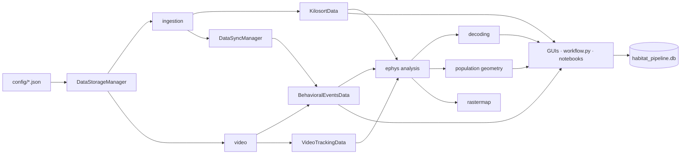

# Habitat Pipeline — Architecture

Multi-animal electrophysiology and behavioral analysis pipeline for freely behaving animals. Loads spike-sorted neural data (Kilosort 4) and behavioral data (tracking + scored events), aligns them on a common clock, and supports decoding, population-geometry, and visualization workflows through a Python API, a CLI, two GUIs, and notebooks.

## High-Level Architecture

## Repository Layout

| Path | Purpose |
|---|---|
| [config/](config/) | JSON path configs (`default_paths.json`, `cohort5_paths.json`). |
| [ingestion/](ingestion/) | Data discovery, Kilosort loading, Trodes binary I/O, ephys↔behavior sync. |
| [video/](video/) | Tracking ingestion, behavioral event records, trajectory and event visualization. |
| [ephys/](ephys/) | Quality QA, opponent and location decoding, population geometry, rastermap. |
| [database/](database/) | SQLAlchemy ORM + CLI for session/animal/file metadata (`habitat_pipeline.db`). |
| [gui/](gui/) | Streamlit dashboard ([gui/app.py](gui/app.py) + [gui/tabs/](gui/tabs/)) and Panel app ([gui/interactive_app.py](gui/interactive_app.py)). |
| [workflow.py](workflow.py) | End-to-end CLI orchestrator. |
| [tests/](tests/) | pytest suite + demo notebooks. |

## Module Reference

### `config/` — Path Configuration

Plain JSON files declaring root paths to ephys, video, tracking, and event data. `DataStorageManager` consumes the active config and resolves session-level paths from it.

### `ingestion/` — Data Discovery and I/O

[ingestion/data_paths.py](ingestion/data_paths.py) — central path manager.

| Symbol | Purpose |
|---|---|
| `DataStorageManager(animal_id, session_id, config_path=None, auto_load=True)` | Discovers and validates all session files. Hub passed to downstream loaders. |
| `.get_kilosort_path()` / `.get_dio_path(channel)` / `.get_pulse_log_path()` | Resolve ephys-side paths. |
| `.get_video_files()` / `.get_tracking_files()` / `.get_behavioral_event_files()` | Resolve behavior-side paths. |
| `get_animals_and_sessions(config_path=None)` | Scan ephys root and return a DataFrame of available sessions. |

[ingestion/kilosort_data_import.py](ingestion/kilosort_data_import.py) — Kilosort 4 loader and quality metrics.

| Symbol | Purpose |
|---|---|
| `KilosortData` | Spike-sorted session container; accepts a `DataStorageManager` or raw path. |
| `.spike_times_by_cell` / `.ks_ids` / `.cluster_info` | Per-cluster spikes and metadata. |
| `.calculate_firing_pattern_metrics()` | Firing rate, presence ratio, ISI CV per cluster. |
| `.filter_cells_by_firing_patterns()` | Apply quality thresholds. |
| `.get_event_aligned_spikes()` / `.bin_spike_times()` | Align spikes to behavioral events; bin to fixed intervals. |
| `load_kilosort_data(dm_or_path)` | Free function with auto-detection of input type. |

[ingestion/kilosort_data.py](ingestion/kilosort_data.py) — low-level Kilosort file parser used by the high-level loader.

[ingestion/ephys_sync.py](ingestion/ephys_sync.py) — ephys↔behavior clock alignment via DIO inter-pulse intervals.

| Symbol | Purpose |
|---|---|
| `load_ephys_sync(data_manager, dio_channel=1)` ([ingestion/ephys_sync.py:14](ingestion/ephys_sync.py#L14)) | Load DIO pulses + pulse-log timestamps. |
| `find_sync_mapping(TSESync, TSBSync, system_time, ...)` ([ingestion/ephys_sync.py:50](ingestion/ephys_sync.py#L50)) | Linear regression on matched IPIs; returns slope/intercept/r² and converters. |
| `DataSyncManager(data_manager, dio_channel=1)` ([ingestion/ephys_sync.py:233](ingestion/ephys_sync.py#L233)) | Stateful sync object exposing `convert_ephys_to_behavior(t)` / `convert_behavior_to_ephys(t)`. |
| `plot_sync_results(mapping_dict, ...)` ([ingestion/ephys_sync.py:128](ingestion/ephys_sync.py#L128)) | Diagnostic plots for sync quality. |

[ingestion/trodes_to_python.py](ingestion/trodes_to_python.py) — `readTrodesExtractedDataFile()` for SpikeGadgets binary DIO/LFP files.

### `video/` — Tracking and Behavioral Events

[video/tracking_import.py](video/tracking_import.py) — multi-format position tracking loader.

| Symbol | Purpose |
|---|---|
| `load_tracking_data(data_manager, file_index=0)` ([video/tracking_import.py:22](video/tracking_import.py#L22)) | Load tracking DataFrame for a session. |
| `parse_tracking(df)` ([video/tracking_import.py:152](video/tracking_import.py#L152)) | Split combined frame into per-animal DataFrames. |
| `load_timestamps(path)` ([video/tracking_import.py:98](video/tracking_import.py#L98)) | Read frame timestamps. |
| `VideoTrackingData` ([video/tracking_import.py:214](video/tracking_import.py#L214)) | Container with parsed trajectories and helpers. |
| `create_tracking_data_from_manager(data_manager, ...)` ([video/tracking_import.py:543](video/tracking_import.py#L543)) | Convenience constructor from `DataStorageManager`. |

[video/behavioral_events.py](video/behavioral_events.py) — scored interaction events.

| Symbol | Purpose |
|---|---|
| `BehavioralEventsData` ([video/behavioral_events.py:26](video/behavioral_events.py#L26)) | Dataclass holding `events_df`, event-type vocabulary, animal IDs. |
| `.synchronize_with_ephys(sync_manager, create_new_columns=True)` | Add `ts_*_ephys` columns aligned to neural clock. |
| `.extract_opponent_labels(...)` | Labels for opponent-identity decoding. |
| `.get_events_by_type()` / `.get_events_by_rat()` | Filtering helpers. |
| `load_behavioral_events(files, session_id=...)` ([video/behavioral_events.py:249](video/behavioral_events.py#L249)) | Free loader function (used by the GUI). |

[video/behavioral_visualization.py](video/behavioral_visualization.py) — event-centric plots.

| Symbol | Purpose |
|---|---|
| `plot_rat_interaction_heatmap(events, ...)` | Pairwise interaction counts between animals. |
| `plot_rat_behavior_heatmap(events, ...)` | Per-animal behavior frequency heatmap. |
| `plot_behavioral_event_timeline(events, ...)` | Event raster across the session. |
| `plot_events_on_trajectory(events, tracking, ...)` | Overlay events on movement paths. |

[video/plot_trajectory.py](video/plot_trajectory.py) — trajectory and occupancy plots: `plot_animal_path`, `plot_multiple_paths`, `plot_path_heatmap`, `plot_territorial_occupancy`, `plot_voronoi_territories`, `plot_proximity_network`, plus `calculate_path_distance` / `calculate_path_statistics`.

### `ephys/` — Neural Analysis

[ephys/decode_opponent_identity.py](ephys/decode_opponent_identity.py) — per-cell and population LDA decoding of which animal the focal animal is interacting with.

| Symbol | Purpose |
|---|---|
| `align_spikes_to_events(spike_times, ...)` ([ephys/decode_opponent_identity.py:61](ephys/decode_opponent_identity.py#L61)) | Window spikes around behavioral event times. |
| `extract_firing_rate_features(...)` ([ephys/decode_opponent_identity.py:97](ephys/decode_opponent_identity.py#L97)) | Time-bin firing-rate feature matrices. |
| `decode_opponent_identity_single_cell(...)` ([ephys/decode_opponent_identity.py:134](ephys/decode_opponent_identity.py#L134)) | Cross-validated LDA per cell. |
| `decode_opponent_identity_population(ks_data, behavior_data, ...)` ([ephys/decode_opponent_identity.py:259](ephys/decode_opponent_identity.py#L259)) | Population sweep returning per-cell results dict. |
| `plot_decoding_accuracy_distribution` / `plot_best_cells_decoding` / `plot_decoding_summary` / `plot_top_cells_firing_rates` | Reporting plots. |
| `main()` | CLI entry. |

[ephys/decode_location.py](ephys/decode_location.py) — decode (x, y) of self/other animals from neural population activity.

| Symbol | Purpose |
|---|---|
| `build_binned_data(ks_data, tracking_data, object_name, bin_size)` ([ephys/decode_location.py:40](ephys/decode_location.py#L40)) | Aligned firing-rate × position matrix. |
| `decode_location_single_cell(...)` ([ephys/decode_location.py:146](ephys/decode_location.py#L146)) | Tuning-curve-based single-cell decoder. |
| `decode_location_population(...)` ([ephys/decode_location.py:370](ephys/decode_location.py#L370)) | Bayesian population decoder. |
| `decode_all_locations(...)` ([ephys/decode_location.py:483](ephys/decode_location.py#L483)) | Sweep over tracked objects. |
| `plot_decoding_results` / `plot_all_decoding_summary` | Reporting plots. |

[ephys/population_geometry.py](ephys/population_geometry.py) — population dynamics and dimensionality reduction.

| Symbol | Purpose |
|---|---|
| `PopulationGeometryAnalyzer(ks_data, behavior_data)` ([ephys/population_geometry.py:46](ephys/population_geometry.py#L46)) | Build population matrices, run PCA/UMAP, analyze trajectories. |
| `plot_pca_trajectory_with_events(...)` ([ephys/population_geometry.py:865](ephys/population_geometry.py#L865)) | 3D PCA trajectory annotated with event markers. |
| `run_population_analysis_pipeline(ks_data, behavior_data, ...)` ([ephys/population_geometry.py:1061](ephys/population_geometry.py#L1061)) | End-to-end population analysis workflow. |

[ephys/plot_ephys_qa_stats.py](ephys/plot_ephys_qa_stats.py) — quality metric visualization: `plot_firing_pattern_histograms`, `plot_pass_fail_histograms`, `test_threshold_combinations`, `load_and_analyze_data`. CLI via `main()`.

[ephys/rastermap_viz.py](ephys/rastermap_viz.py) — Rastermap-based population visualization (Stringer et al. 2024): `run_rastermap`, `plot_rastermap`, `plot_rastermap_interactive`, `plot_rastermap_with_events`.

### `database/` — Metadata Persistence

[database/database_core.py](database/database_core.py) — SQLAlchemy ORM over `habitat_pipeline.db`.

| Symbol | Purpose |
|---|---|
| `Animal` ([database/database_core.py:27](database/database_core.py#L27)) | Animal records. |
| `ExperimentSession` ([database/database_core.py:49](database/database_core.py#L49)) | Session metadata linked to animals. |
| `DataFile` ([database/database_core.py:71](database/database_core.py#L71)) | Registry of ephys/tracking/event files. |
| `HabitatDatabase` ([database/database_core.py:93](database/database_core.py#L93)) | High-level DB API (add/query/update). |
| `create_database(db_path=None)` ([database/database_core.py:457](database/database_core.py#L457)) | Initialize a fresh DB. |

[database/database_cli.py](database/database_cli.py) — `argparse` subcommands: `init_database`, `add_animal`, `add_session`, `scan_directory`, `show_status`, `export_summary`.

[database/database_integration.py](database/database_integration.py) — bridge between DB and pipeline.

| Symbol | Purpose |
|---|---|
| `PipelineIntegration` ([database/database_integration.py:16](database/database_integration.py#L16)) | Register Kilosort/tracking outputs against sessions. |
| `quick_setup(data_directory, db_path=None)` ([database/database_integration.py:233](database/database_integration.py#L233)) | One-call DB scaffolding. |
| `get_database` / `get_session_list` / `load_session` | Convenience accessors. |

### `gui/` — Interactive Dashboards

Two parallel UIs share the same backing modules.

[gui/app.py](gui/app.py) — Streamlit entry. Run with `streamlit run gui/app.py`. Sidebar selects cohort + session; tabs in [gui/tabs/](gui/tabs/) render content:

| Tab | File |
|---|---|
| Tracking | [gui/tabs/tracking.py](gui/tabs/tracking.py) |
| Behavioral | [gui/tabs/behavioral.py](gui/tabs/behavioral.py) |
| Decoding | [gui/tabs/decoding.py](gui/tabs/decoding.py) |
| Population | [gui/tabs/population.py](gui/tabs/population.py) |

[gui/loaders.py](gui/loaders.py) — `@st.cache_resource` wrappers (`get_data_storage`, `get_ks_data`, `get_behavior_data`, `get_sync`) so heavy data is loaded once per session.

[gui/interactive_app.py](gui/interactive_app.py) — Panel app exposing `HabitatApp.layout` (a `FastListTemplate`). Linked Bokeh timeline + rastermap with a Plotly 3D PCA panel; uses `pn.state.cache` to survive theme reloads. Run with `panel serve gui/interactive_app.py --show`.

### `workflow.py` — CLI Orchestrator

Run with `python workflow.py --animal_id 613 --session_id 20251210`. Steps:

| Function | Step |
|---|---|
| `parse_arguments()` | Parse CLI flags (animal/session IDs, `--skip_*` toggles, output dir). |
| `process_kilosort_data(...)` | Load and quality-filter spikes. |
| `process_tracking_data(...)` | Load tracking and emit trajectory plots. |
| `process_synchronization(...)` | Compute ephys↔video sync. |
| `generate_visualizations(...)` | Render configured figures. |
| `main()` | Glue the above. |

## Key Data Structures

**`DataStorageManager`** — central session handle holding `kilosort_path`, `video_files`, `tracking_files`, `behavioral_event_files`, `dio_paths`, and `metadata`. Every loader accepts one.

**`KilosortData`** — `spike_times_by_cell: List[np.ndarray]`, `ks_ids`, `cluster_info`, plus computed quality fields (`firing_rates`, `presence_ratios`, `cv_isi`, `quality_thresholds`).

**`BehavioralEventsData`** — dataclass with `events_df` (initiator/victim/type/timestamps), `event_types`, `animal_ids`, optional `ts_*_ephys` columns added by `synchronize_with_ephys`.

**`DataSyncManager`** — wraps the linear mapping returned by `find_sync_mapping`; exposes `convert_ephys_to_behavior(t)` / `convert_behavior_to_ephys(t)` and a residuals plot.

**Decoding result dicts** — `{cluster_id: {accuracy, confusion_matrix, cv_scores, ...}}` plus aggregated population fields, consumed by the `plot_*` reporters.

## Typical Analysis Pipeline

1. `dsm = DataStorageManager(animal_id, session_id)` — discover paths.
2. `ks = KilosortData(dsm)` and `be = BehavioralEventsData(dsm)` — load neural and behavioral data.
3. `sync = DataSyncManager(dsm, dio_channel=1); be.synchronize_with_ephys(sync)` — put events on the neural clock.
4. Run analysis: `decode_opponent_identity_population(ks, be, ...)`, `decode_location_population(...)`, `PopulationGeometryAnalyzer(ks, be)`, or `plot_rastermap(ks, ...)`.
5. Visualize via the `plot_*` functions, browse interactively in a GUI, or persist metadata through `database/`.

## Entry Points

| Entry | Command |
|---|---|
| Python API | `from ingestion.data_paths import DataStorageManager` (see [README.md](README.md) Quick Start). |
| CLI workflow | `python workflow.py --animal_id <id> --session_id <id>`. |
| Streamlit GUI | `streamlit run gui/app.py`. |
| Panel GUI | `panel serve gui/interactive_app.py --show`. |
| Database CLI | `python -m database.database_cli <subcommand>`. |
| Notebooks | [pipeline_demo.ipynb](pipeline_demo.ipynb), [test.ipynb](test.ipynb), [db_example.ipynb](db_example.ipynb), [ephys/LDA_demo.ipynb](ephys/LDA_demo.ipynb), [video/trajectory_plots_examples.ipynb](video/trajectory_plots_examples.ipynb), [tests/KilosortData_test_demo.ipynb](tests/KilosortData_test_demo.ipynb). |

## Capabilities

| Feature | Module(s) |
|---|---|
| Automated data discovery | [ingestion/data_paths.py](ingestion/data_paths.py) |
| Kilosort 4 ingestion + quality filtering | [ingestion/kilosort_data_import.py](ingestion/kilosort_data_import.py), [ephys/plot_ephys_qa_stats.py](ephys/plot_ephys_qa_stats.py) |
| Multi-animal tracking | [video/tracking_import.py](video/tracking_import.py), [video/plot_trajectory.py](video/plot_trajectory.py) |
| Behavioral event analysis | [video/behavioral_events.py](video/behavioral_events.py), [video/behavioral_visualization.py](video/behavioral_visualization.py) |
| Ephys↔behavior synchronization | [ingestion/ephys_sync.py](ingestion/ephys_sync.py) |
| Opponent identity decoding | [ephys/decode_opponent_identity.py](ephys/decode_opponent_identity.py) |
| Location decoding | [ephys/decode_location.py](ephys/decode_location.py) |
| Population geometry (PCA/UMAP/trajectories) | [ephys/population_geometry.py](ephys/population_geometry.py) |
| Rastermap visualization | [ephys/rastermap_viz.py](ephys/rastermap_viz.py) |
| Streamlit + Panel dashboards | [gui/app.py](gui/app.py), [gui/interactive_app.py](gui/interactive_app.py) |
| CLI orchestration | [workflow.py](workflow.py) |
| Metadata database (SQLite) | [database/](database/) |
